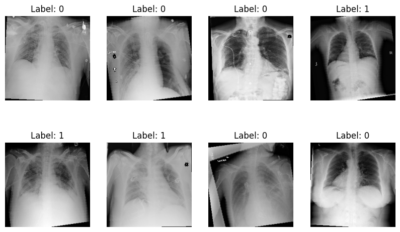

# Chest X-ray Pneumonia Classification

This project presents a deep learning approach for automatic pneumonia detection from chest X-ray images using transfer learning.

Two pre-trained convolutional neural network architectures were fine-tuned and evaluated:

- ResNet18
- EfficientNet-B0

The project was implemented using PyTorch and trained on a public chest X-ray dataset.

---

## Project Overview

The workflow includes:

- Loading DICOM chest X-ray images
- Reading image labels from CSV files
- Image preprocessing
- Data augmentation
- Fine-tuning pre-trained CNN models
- Model evaluation using multiple metrics

---

## Dataset

Dataset source:
https://www.kaggle.com/competitions/rsna-pneumonia-detection-challenge

## Sample Dataset Images

  

Example chest X-ray images from the RSNA Pneumonia Detection Challenge dataset.

Dataset contains:
- stage_2_train_images
- stage_2_test_images
- stage_2_train_labels.csv
- stage_2_detailed_class_info.csv

The labels were converted into a binary classification problem:

- Normal (0)
- Pneumonia (1)

---

## Models

### ResNet18

Transfer learning using ImageNet pretrained weights.

### EfficientNet-B0

Transfer learning using ImageNet pretrained weights.

Both models were fine-tuned for pneumonia classification.

---

## Evaluation Metrics

- Accuracy
- Precision
- Recall
- F1-score
- ROC-AUC
- Confusion Matrix
---

## Results

| Model | Accuracy | Precision | Recall | F1-score |
|-------|---------:|----------:|--------:|---------:|
| EfficientNet-B0 | 79.6% | 78.7% | 81.2% | 79.9% |
| ResNet18 | 76.8% | 72.9% | 85.2% | 78.5% |

EfficientNet-B0 achieved the higher overall accuracy and precision, while ResNet18 obtained a higher recall, indicating better sensitivity in detecting pneumonia cases.

---
## Technologies

- Python
- PyTorch
- torchvision
- NumPy
- Pandas
- Matplotlib
- scikit-learn
